<div align="center">

# 📖 Passage

### *Every passage is a learning opportunity.*

**An AI-ready language-learning mobile app that turns reading into a complete vocabulary loop:
read → understand → save with context → review with spaced repetition.**

Built with **React Native (Expo)** · Powered by the **CEFR Texts API** · Dictionary by **Free Dictionary API**

</div>

---

## Table of Contents

- [Overview](#overview)
- [Features](#features)
- [How it works (architecture)](#how-it-works-architecture)
- [Tech stack](#tech-stack)
- [Data source (CEFR dataset)](#data-source-cefr-dataset)
- [The backend API](#the-backend-api)
- [Prerequisites](#prerequisites)
- [Getting started](#getting-started)
- [Connecting the app to your API](#connecting-the-app-to-your-api)
- [Configuration](#configuration)
- [Project structure](#project-structure)
- [How key features work](#how-key-features-work)
- [Data & privacy](#data--privacy)
- [Building for production](#building-for-production)
- [What NOT to commit to GitHub](#what-not-to-commit-to-github)
- [Troubleshooting](#troubleshooting)
- [Roadmap (Pro features)](#roadmap-pro-features)
- [Credits & acknowledgements](#credits--acknowledgements)
- [License](#license)

---

## Overview

**Passage** is a mobile language-learning app designed around a simple idea: real reading is the
best way to learn a language — if every word you don't know can become a lasting memory.

The app has two intended tiers. **This repository implements the _Free experience_ only.** The
Pro tier (AI passage generation, quizzes, analytics, AI conversation) is intentionally **out of
scope** here and listed in the [roadmap](#roadmap-pro-features).

The Free experience lets a learner:

1. Browse a large library of **CEFR-levelled** English passages (A1 → C2).
2. Read them in a clean reader or **listen** via text-to-speech.
3. **Tap any unknown word** to see its meaning instantly.
4. **Save words with the sentence they appeared in** (context-aware vocabulary).
5. **Review** saved words later with a two-sided flashcard system driven by **spaced repetition**.
6. Get optional **reminders** when words are due for review.

---

## Features

| Area | What it does |
| --- | --- |
| 📚 **Browse by level** | A1–C2 levels with live passage counts pulled from the API (`/levels`). |
| 🎲 **Random passage** | "Surprise me" button fetches a random passage instantly (`/random`). |
| 📖 **Clean reader** | Distraction-free reading with an adjustable font size. |
| 🔊 **Text-to-Speech** | Listen to the whole passage with on-device TTS (`expo-speech`). |
| 👆 **Tap-to-define** | Tap any word → meaning, part of speech & pronunciation in a pop-up (Free Dictionary API). |
| 🧠 **Context-aware saving** | Saving a word also stores the **exact sentence** it came from, plus source level. |
| 🗂️ **Two-sided flashcards** | Flip cards to recall meaning; listen to pronunciation; revisit original context. |
| ⏱️ **Spaced repetition** | An SM-2–inspired scheduler resurfaces cards at the optimal time. Grade as *Again / Hard / Good / Easy*. |
| 🔔 **Review reminders** | Optional local notifications when words become due (`expo-notifications`). |
| ✅ **Mark as read** | Tap to mark a passage read; a **"Read passages"** list keeps them for quick reopening. |
| 💾 **Offline-friendly personal data** | Your saved words and read list are stored locally on the device. |

---

## How it works (architecture)

Passage is a **thin client**: the passages are **not bundled in the app**. They live on a small
**FastAPI** backend (the *CEFR Texts API*), and the app fetches them over HTTP at runtime. Word
definitions come live from the public **Free Dictionary API**. Only your *personal* data
(flashcards, read list, settings) is stored on the phone.

```mermaid
flowchart LR
    subgraph Phone["📱 Passage app (React Native / Expo)"]
        UI["Screens & UI"]
        Local["AsyncStorage<br/>(flashcards, read list, settings)"]
        TTS["expo-speech (TTS)"]
        Notif["expo-notifications (SRS reminders)"]
    end

    subgraph Server["☁️ CEFR Texts API (FastAPI)"]
        API["/levels /texts /texts/&#123;id&#125; /random"]
        Excel[("CEFR dataset<br/>Excel → in-memory")]
        API --- Excel
    end

    Dict["🌐 Free Dictionary API"]

    UI -- "HTTP: list & read passages" --> API
    UI -- "HTTP: word lookup" --> Dict
    UI <--> Local
    UI --> TTS
    UI --> Notif
```



**Two storage layers, summarized:**

- **Server side** → the 1494 reading passages (read from the CEFR dataset into memory by FastAPI).
- **Device side** → your saved flashcards (with SRS state), your "read passages" list, and the
  API URL setting (via `@react-native-async-storage/async-storage`).

---

## Tech stack

- **Runtime:** Expo SDK **54** · React Native **0.81** · React **19** · TypeScript
- **Navigation:** React Navigation (bottom tabs + native stacks)
- **Speech:** `expo-speech` (text-to-speech)
- **Notifications:** `expo-notifications` + `expo-device`
- **Local storage:** `@react-native-async-storage/async-storage`
- **Backend (separate):** FastAPI + Uvicorn + pandas
- **External API:** [Free Dictionary API](https://dictionaryapi.dev/) (definitions & audio)

> Expo **54** is targeted on purpose so the project opens in the current Play Store / App Store
> build of **Expo Go**. Newer SDKs may require a newer Expo Go than is publicly available.

---

## Data source (CEFR dataset)

The reading passages are based on the **CEFR Levelled English Texts** dataset:

🔗 **https://www.kaggle.com/datasets/amontgomerie/cefr-levelled-english-texts**

The backend loads this dataset (an Excel/CSV export) and groups texts by CEFR level. Counts used in
the app:

| Level | Texts |
| --- | --- |
| A1 | 288 |
| A2 | 272 |
| B1 | 205 |
| B2 | 286 |
| C1 | 241 |
| C2 | 202 |
| **Total** | **1494** |

> ⚠️ **Licensing:** the dataset is hosted on Kaggle by *amontgomerie*. Review and comply with the
> dataset's license on its Kaggle page before any public/commercial distribution. Do not commit the
> raw dataset file to this repository (see [What NOT to commit](#what-not-to-commit-to-github)).

---

## The backend API

The app talks to a FastAPI service (the *CEFR Texts API*) that serves the dataset. It is a
**separate project** and is **not** part of this mobile repo. Expected endpoints:

| Method | Endpoint | Description |
| --- | --- | --- |
| `GET` | `/` | API info + per-level counts |
| `GET` | `/levels` | `{ "A1": 288, "A2": 272, ... }` |
| `GET` | `/texts?level=B1&page=1&limit=20` | Paginated list: `{ total, page, limit, pages, results }` |
| `GET` | `/texts/{id}` | A single passage `{ id, text, label }` |
| `GET` | `/random?level=A2&count=1` | Random passage(s): `{ results: [...] }` |

A passage object looks like:

```json
{ "id": 42, "text": "The sun is a star...", "label": "B1" }
```

> The app's API client (`src/api/cefr.ts`) is defensive: it accepts common field aliases
> (`text`/`content`/`body`, `level`/`label`, `title`/`name`), and both bare arrays and
> `{ results: [...] }` / `{ items: [...] }` envelopes — so small backend changes won't break it.

**Run the backend** (from the API project folder):

```bash
pip install -r requirements.txt
uvicorn main:app --host 0.0.0.0 --port 8000
```

> `--host 0.0.0.0` is required so a phone on the same Wi-Fi can reach it (not just `localhost`).

---

## Prerequisites

- **Node.js** ≥ 18 (LTS recommended) and **npm**
- **Expo Go** app on your phone (Android Play Store / iOS App Store), **or** an emulator/simulator
- The **CEFR Texts API** running and reachable (locally or deployed)
- Phone and computer on the **same Wi-Fi network** (for local development)

---

## Getting started

```bash
# 1. Install dependencies
npm install

# 2. Start the Expo dev server (clears cache)
npx expo start -c
```

Then:

- **Physical phone:** open **Expo Go** and scan the QR code in the terminal.
- **Android emulator:** press `a`  ·  **iOS simulator:** press `i`  ·  **Web preview:** press `w`

Available scripts:

```bash
npm start         # expo start
npm run android   # open on Android
npm run ios       # open on iOS (macOS only)
npm run web       # open web preview
```

---

## Connecting the app to your API

A phone/emulator **cannot** reach your computer's `localhost`. Use the correct address:

| Where the app runs | API base URL |
| --- | --- |
| Android emulator | `http://10.0.2.2:8000` |
| iOS simulator | `http://localhost:8000` |
| **Physical device (Expo Go)** | `http://<YOUR-PC-LAN-IP>:8000` (e.g. `http://192.168.1.10:8000`) |
| Deployed backend | `https://your-app.up.railway.app` |

**Set it in two ways:**

1. **In-app (recommended for dev):** open the **Settings** tab → type the URL → **Test connection**
   → **Save**. The URL is remembered on the device.
2. **In code (becomes the default):** edit `DEFAULT_API_BASE_URL` in `src/config.ts`.

> 💡 Find your PC's LAN IP with `ipconfig` (Windows) / `ifconfig` (macOS/Linux) — use the
> Wi-Fi/Ethernet `IPv4 Address`, **not** the WSL/virtual adapter address.

### Windows firewall note

If Expo Go loads the app but the library says **"Can't reach the library / aborted"**, Windows
Firewall is likely blocking port 8000. Allow it (run **PowerShell as Administrator**):

```powershell
netsh advfirewall firewall add rule name="Passage API 8000" dir=in action=allow protocol=TCP localport=8000
```

---

## Configuration

Everything tweakable lives in `src/config.ts`:

- `DEFAULT_API_BASE_URL` — the API address used until the user overrides it in Settings.
- `DICTIONARY_API_BASE` — Free Dictionary API base (English).
- `STORAGE_KEYS` — AsyncStorage keys for flashcards, progress, read passages, and the API URL.

Visual design tokens (colors, spacing, radius, typography, shadows) live in `src/theme.ts`.

---

## Project structure

```
App.tsx                      # Providers (settings, library) + navigation container
index.ts                     # Expo entry point
app.json                     # Expo app config (name, icons, notifications plugin)
src/
├── config.ts                # API base URL, dictionary base, storage keys
├── theme.ts                 # Design system: colors, spacing, typography, shadows
├── types.ts                 # Shared types: Passage, Flashcard, ReadPassage, ...
├── api/
│   ├── cefr.ts              # CEFR Texts API client (normalizes responses)
│   └── dictionary.ts        # Free Dictionary API client
├── context/
│   ├── SettingsContext.tsx  # API base URL + API client instance
│   └── LibraryContext.tsx   # Flashcards, read list, SRS, persistence
├── navigation/
│   ├── index.tsx            # Bottom tabs + per-tab native stacks
│   └── types.ts             # Navigation param types
├── screens/
│   ├── HomeScreen.tsx       # Level list, random button, read-passages list
│   ├── PassageListScreen.tsx# Paginated passages for a level
│   ├── ReaderScreen.tsx     # Tappable words, TTS, mark-as-read
│   ├── DeckScreen.tsx       # Saved flashcards + due overview
│   ├── ReviewScreen.tsx     # Two-sided spaced-repetition review
│   └── SettingsScreen.tsx   # API config + reminders
├── components/
│   ├── ui.tsx               # Buttons, cards, chips, badges, empty states
│   └── WordDefinitionModal.tsx # Tap-to-define pop-up + save
└── utils/
    ├── tokenize.ts          # Word/sentence tokenizer (captures context)
    ├── srs.ts               # SM-2–inspired spaced-repetition scheduler
    ├── speech.ts            # TTS helpers
    └── notifications.ts      # Review reminder scheduling
```

---

## How key features work

**Context-aware vocabulary.** When you tap a word, `tokenize.ts` already knows which **sentence**
it belongs to. Saving the word stores that sentence alongside the definition, so flashcards always
show the word in its original context — which dramatically improves retention.

**Spaced repetition (SRS).** Each saved word carries scheduling state (`repetitions`, `easeFactor`,
`intervalDays`, `dueAt`). After a review you grade your recall; `srs.ts` (an SM-2 variant) computes
the next due date. "Again" repeats in minutes; "Good"/"Easy" push the interval out over days →
weeks → months. Due cards surface in the **Flashcards** tab (with a badge) and can trigger a
reminder.

**Reader.** The passage is rendered as tappable word tokens inside flowing text. Saved words are
highlighted. A floating toolbar offers font size and listen/stop. A "Mark as read" button records
the passage to your **Read passages** list.

---

## Data & privacy

- **No account, no sign-in.** The Free experience requires no login.
- **Personal data stays on the device** (AsyncStorage): saved flashcards, the read-passages list,
  and your API URL setting. Uninstalling the app clears it.
- **Network calls** go only to: your configured **CEFR Texts API** and the public **Free Dictionary
  API**. Nothing else is collected or sent.

---

## Building for production

To ship a real app, users should **not** type an API URL. Instead:

1. **Deploy the backend** to a host with a public **HTTPS** URL (Railway / Render / Fly.io). A
   `Procfile` example: `web: uvicorn main:app --host 0.0.0.0 --port $PORT`.
2. **Set the default** in `src/config.ts`:
   ```ts
   export const DEFAULT_API_BASE_URL = 'https://your-app.up.railway.app';
   ```
3. **Build with EAS:**
   ```bash
   npm install -g eas-cli
   eas login
   eas build:configure
   eas build -p android        # APK/AAB
   eas build -p ios            # requires an Apple Developer account
   ```

> ⚠️ Production builds require **HTTPS** for the API. iOS (App Transport Security) and Android (by
> default) block plain `http://`. Local `http://` works only during development.

---

## What NOT to commit to GitHub

A `.gitignore` is already configured. Make sure these are **never pushed**:

| Don't commit | Why |
| --- | --- |
| `node_modules/` | Huge; reinstalled via `npm install`. |
| `.expo/`, `dist/`, `web-build/`, `expo-env.d.ts` | Generated build/cache output. |
| `/android`, `/ios` | Generated native folders (only if you run prebuild). |
| `.env`, `.env*.local` | Secrets / local configuration. |
| `*.jks`, `*.p8`, `*.p12`, `*.key`, `*.mobileprovision`, `*.pem` | **Signing keys & certificates** — leaking these is a serious security risk. |
| `cefr_api/`, `*.xlsx`, `*.zip` | The backend and the raw **CEFR dataset** belong in their own repo and may have licensing constraints. |
| `.expo-export-test/` | Temporary export output used for build checks. |
| `.DS_Store`, `*.orig.*`, `*-debug.*` | OS / editor / debug junk. |

> ✅ **Do commit:** all of `src/`, `App.tsx`, `index.ts`, `app.json`, `package.json`,
> `package-lock.json`, `tsconfig.json`, `.gitignore`, and this `README.md`.

---

## Troubleshooting

| Symptom | Fix |
| --- | --- |
| **"Project is incompatible with this version of Expo Go"** | Update Expo Go from the store. The project targets SDK 54; if your Expo Go is older, update it (or align the SDK). |
| **"Can't reach the library" / "aborted"** | API not running, wrong URL, or firewall. Ensure `uvicorn ... --host 0.0.0.0`, use your **LAN IP** (not `localhost`), and allow port 8000 in the firewall. |
| **QR loads the app but no passages** | Wrong API address — set it in **Settings → Test connection**. Make sure phone & PC share the same Wi-Fi. |
| **No word definition** | The word may not exist in the dictionary, or there's no internet. Try another word. |
| **No review reminders** | Notifications need a **physical device** and granted permission (enable in Settings). |
| **Metro cache issues / weird errors** | Restart with `npx expo start -c`. |

---

## Roadmap (Pro features)

Planned for a future Pro tier (not in this repo):

- 🤖 **AI passage generation** (e.g. Gemini): unlimited passages tailored to interests & level.
- 📝 **Mini quizzes**: auto-generated 5-question quizzes after each passage.
- 📊 **Learning analytics dashboard**: passages read, words learned, quiz scores, streaks.
- 💬 **AI conversation**: discuss a passage, ask grammar/vocab questions, practice writing/speaking.

---

## Credits & acknowledgements

- **Dataset:** [CEFR Levelled English Texts](https://www.kaggle.com/datasets/amontgomerie/cefr-levelled-english-texts) by *amontgomerie* (Kaggle).
- **Definitions & pronunciation:** [Free Dictionary API](https://dictionaryapi.dev/).
- **Framework:** [Expo](https://expo.dev/) & [React Native](https://reactnative.dev/).
- Spaced repetition inspired by the **SM-2** algorithm.

---

## License

Released under the **MIT License** — see [`LICENSE`](./LICENSE).

> Note: the MIT license covers **this app's source code**. It does **not** relicense third-party
> assets. Before any public or commercial distribution, verify the licenses of the **CEFR dataset**
> (Kaggle) and the **Free Dictionary API** separately.

<div align="center">

**Passage — read, understand, remember, grow.**

</div>
